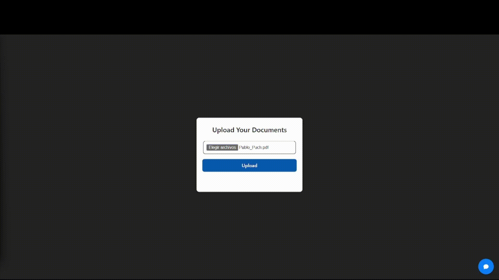

# Chat-file

Here are the steps to download and install your document chat with LLM Llama 3.1.




## Installation

Clone repo

```bash
git clone https://github.com/pablopuch/chat_rag_llama.git
```

Move to frontend

```bash
cd frontend/
```

Installation npm

```bash
npm install
```

Move to backend

```bash
cd backend/
```
Create a virtual environment

```
py -m venv env
```

Activate the virtual environment

**macOS/Linux**

```
source env/bin/activate
```

**Windows**

```
.\env\Scripts\activate
```

Install dependencias

```
 pip install -r requirements.txt
```

Run backend

```
fastapi dev main.py
```

Run server ollama

```
ollama server
``` 

Run frontend

```
npm run dev
```

## 🛠️ Stack

- [![Astro][astro-badge]][astro-url] - The web framework for content-driven websites.
- [![Typescript][typescript-badge]][typescript-url] - JavaScript with syntax for types.
- [![Tailwind CSS][tailwind-badge]][tailwind-url] - A utility-first CSS framework for rapidly building custom designs.
- [![@midudev/tailwind-animations][animations-badge]][animations-url] - Easy peasy animations for your Tailwind project.

<p align="right">(<a href="#readme-top">volver arriba</a>)</p>
